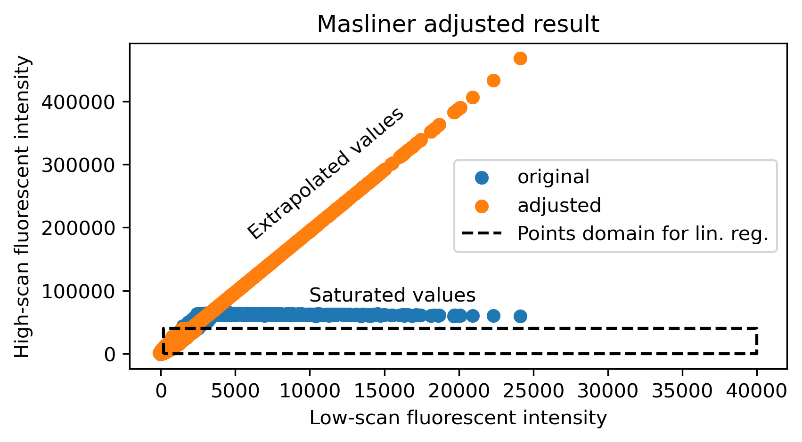
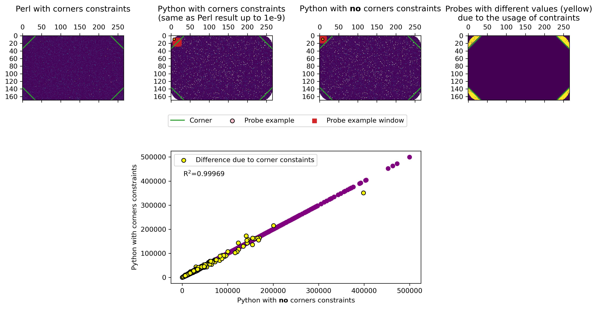

# Processing Protein Binding Microarray Data

## Introduction

The fluorescent signal of a Protein Binding Microarray (PBM) carries information about the binding specificities of a transcription factor (TF). 
However, the signal does not explicitly expose the binding specificity.
Often, experimental sources in the assay alter or truncate the signal.
The Python scripts here aim to remove such experimental variations, leaving the specific-binding signal from a PBM.
We designed the scripts to perform the same functionalities as provided originally in `PBM_analysis_suite_Sep2017` Perl scripts (Berger et al., 2009), which can be downloaded from the Bulyk lab website.
We reimplemented the Masliner and spatial-normalization functions, removed the features we do not usually perform, and made the code easier to read/utilize.

Briefly, masliner functionality aims to combine two scans (of the same array, scanned one after the other) of different dynamic range (by adjusting different gains).
The combination extends the information and avoids saturation/low detection deficiencies (see Masliner section).
One can skip it by providing a single GPR file.

The normalization functionality aims to remove spatial correlation in the scan.
Recall that given a design with the probes being randomly distributed over the array, we expect the signal to behave randomly in space.
Spatial correlation in the signal indicates some physical source in the array that interferes with the signal/fluorophore solution, which the script means to remove by applying a moving window, and dividing each probe by its local median of the window (see normalization section).


## Quick Start

1. Make sure your Python environment contains the installed Numpy, Pandas, Matplotlib, and Scipy packages.

2. Change directory in the terminal to the one that contains the `process.py`, e.g., in bash:
```
cd processpbm
```

3. Run:
```
python process.py [-g1 GPR1] [-g2 GPR2] [-f FASTA] [-i INTENSITY_COLUMN] [-o OUTPUT] [-ll LOW_BOUND] [-lh HIGH_BOUND] [-r RADIUS] 

```
### Arguments

`-g1` : str, optional if `g2` is provided

A path to a GPR file.
If two GPR files are to be provided, this file is the low-intensity fluorescent scan one.
Otherwise, the path directs to the single GPR file to be considered and the script will not perform Masliner.

`-g2` : str, optional if `g1` is provided

A path to a GPR file.
If two GPR files are designed to be provided, this file is the high-intensity fluorescent scan one.
Otherwise, the path can directs to the single GPR file to be considered and the script will not perform Masliner.

`-f` :  str

A path to the fasta file.
Fasta file is a text file that contains all probe IDs and sequences of the PBM design in Fasta form (see example in `data`).
The normalization script considers only probes with a sequence provided in the fasta file and does not provide a normalized signal for any other (e.g., controls provided by the manufacturer).
Moreover, the combinatorial file includes only probes with sequences provided in the Fasta file.
Agilent provides the Fasta file in the appropriate format for all designs.

`-i` : str

The fluorescent intensity column in the GPR files to be considered.
Note that in the original scripts, it is the median intensity subtracted by the background.

`-o` : str

The path of output, in the form of `<dir path>/<file prefix>`.


`-ll` : int, optional

By default, 2,000 (same as in the original script).
The linear lower bound for Masliner.
This is the low threshold of intensity to consider for the linear regression.

`-lh` : int, optional

By default, 50,000 (lower than the original default).
The linear high bound for Masliner.
This is the high threshold of intensity to consider for the linear regression.

`-r` : int, optional

By default, 7.
The radius of the moving window is used in normalization.
Use 0 to skip normalization.

### Output

The script saves multiple files in the directory and prefixes the file name provided in the output path argument.
The following are the file suffixes and their descriptions:

`_log.txt` : 
The log text file of the script run.

`_processed.csv` : 
Contains the following columns:
* Block (from original GPR)
* Column (from original GPR)
* Row (from original GPR)
* Name (from original GPR)
* ID (from original GPR)
* Flags (from original GPR)
* \<i\> (if Masliner was not performed) - fluorescent intensity column from original GPR.
* Low $^*$ - low fluorescent intensity column from original GPR.
* High $^*$ - high fluorescent intensity column from original GPR.
* Adj $^*$ - Masliner adjusted values.
* Sequence (from fasta file)
* Top $^†$ - The top row boundary of the moving window.
* Bottom $^†$ - The bottom row boundary of the moving window.
* Left $^†$ - The left column boundary of the moving window.
* Right $^†$ - The right column boundary of the moving window.
* Local window median $^†$ - The considered local median intensity of the window.
* Window size $^†$ - The number of probes in the window used for local median intensity calculation.
* Norm $^†$ - Normalized values.

`_combinatoril.txt` :
The file contains all sequences with processed intensity signals sorted from highest to lowest.
This is the format used for the original Seed-and-wobble Perl script.
The combinatorial file includes only probes with sequences provided in the fasta file.

`_masliner.png` $^*$ :
Figure describing the output of Masliner.

`_normalize.png` $^†$ :
The figure describes the array intensity layout according to the signal provided for the normalization and the normalized signal.

$^*$ - if Masliner was performed.

$^†$ - if normalization was performed.


### Example

```
python process.py -g1 './data/488nm_800_80_1-KLF3LC_2-KLF3HC_3-SP1LC_4-SP1HC_5-IRF1_13.6.24_2-5.gpr' -g2 './data/488nm_1000_80_1-KLF3LC_2-KLF3HC_3-SP1LC_4-SP1HC_5-IRF1_13.6.24_2-5.gpr' -f 'data/086902_D_Fasta_20220417.txt' -i 'F488 Median' -o './data/KLFLC'
```

### Notes


If Masliner is used before normalization, normalization is over the Adj values.
If disabling Masliner (by providing a single GPR file), normalization is over the selected intensity column from the original GPR (supplied by the `i` argument).

One can use the script without Masliner and without normalization by providing a single GPR and setting the radius to 0.
In that case, the script only merges the Fasta file to the GPR and provides the corresponding "processed" and combinatorial file.

## Masliner

The scanner yields 16-bit images, i.e., the image uses 16 bits ($2^{16}=65,536$ unique values) to represent each pixel's intensity.
This information capacity may not be sufficient to capture the signal of TF specific binding at high resolution.
For example, in some cases, one can observe the saturation of the signal.
According to the GenePix manual (2017), the reason may be an overload of photons to be processed and converted into an electric signal, namely, the signal is above the dynamic range of the scan.

One can scan in a shifted dynamic range to capture a saturated signal in its complete informative form (while losing the low signal to underdetection).
In that case, one has two scans, each in a different dynamic range, holding specific binding information.
Note that to change the dynamic range, the manual recommends setting the gain of the scan at different values--- controlling the detector's sensitivity (as opposed to Berger et al., 2009, which claims to change the power of the laser).
The gain values are between 100 and 1000.
By changing the gain between 400 and 1000, unless the signal is underdetected/saturated, the effect of the gain is supposed to be linear.

The two scans must be combined into a single format.
Masliner combines two scans of different dynamic ranges by assuming the above linearity assumption.
To use it properly, one must determine and input the linear range for which the two scans are linearly correlated.
The two threshold arguments, `ll` and `lh`, set the lower and upper bounds of the linear range by the following masking.
If a probe holds the intensity values of $y_1$ and $y_2$ according to the low and high scan provided (respectively), then we will consider it for the linear regression fitting if `ll`$<y_1, y_2<$`lh`.
After fitting the linear regression line, the adjusted values are simply the high scan (with the potential saturation), which holds the robust information for the low-intensity probes.
However, for all values of the high scan above `lh`, the adjusted values are calculated according to the linear regression line, which extrapolates the saturation according to the information provided in the low scan.

In the following image (data from `PBM_analysis_suite_Sep2017`, Berger et al., 2009), the blue points are the scatter plot of low vs. high gain scan (low is the x-axis).
The dashed square is the domain of points used for the linear regression according to the `ll` and `lh` points.
The orange points are the adjusted.
As you can see, the orange and the blue overlap up to the high threshold.
After that, it gets close to the linear range, for which we use the linear regression prediction, utilizing the information from the lower scan and extrapolating it for the higher one.



We note that the default values of `ll` and `lh` is set according to the example in the original documentation of `PBM_analysis_suite_Sep2017`.
 

## Normalization

Most of our designs contain the probe shuffled in the 2-diemnsional space of the array.
Therefore, we expect no spatial correlation between the probe values.
Sometimes, we get spatial correlation due to some factors (e.g., dust), which the normalization functionality aims to remove.
The idea in the original `PBM_analysis_suite_Sep2017` Perl script is to calculate the median intensity of the neighborhood (surrounding square) for each probe and multiply the probe value by the global to the local median ratio.
If the probe is located in a local region of high intensity, the operation should reduce it, and vice versa.
We note that upon calculating the local median, the operation will mask out the intensity of probes not provided in the Fasta file (e.g., Agilent controls) or that are flagged.
Moreover, if the function masks out more than half of the probes, the normalization renders the normalized value as the input (i.e., skip it).

The operation is straightforward except for some constraints when calculating a local median.
When the probe is at the edge of the array, some local windows penetrate outside the array.
Therefore, the scheme is to shift the window into the array until it is entirely in it.
For example, given a probe on the top of the array, we will shift the window downward until it is entirely inside the array such that the probe is located at the top center of the window.

One of the main problems in the original script is the usage of corner constraints on the local window.
Each design has some regions in the array in its corners where local windows would be shifted diagonally into the array, analogously to the edge constraints described above.
We could not find any explanation of such a scheme, but we did notice that those corners are designed differently depending on the Agent layout.
Moreover, they correspond to the area at the corners of the array, which comprises many Agilent control probes.
So, for probes (the designed one, not Agilent control) close to a control region with no specific binding signal, the local median is treated as the one within the array on the corner line.
We do not use such a scheme for several reasons.
First, we are unsure how objective such a scheme is in getting the "true" signal at those corners.
Secondly, one needs to manually adjust the corners for each design (including the LC-science one).
Thirdly, in several cases, for example, Agielnt 15K and LC-science 48K design, the corner controls are so small that they do not need special treatment (we mention again that any control probe is not taken into the local median calculation).
Lastly, as you will see in the following, removing the corner constraint does not make a big difference in values.

In the following image (data from `PBM_analysis_suite_Sep2017`, Berger et al., 2009), four array plots of the same 45K probe design are displayed.
From left to right, the first is the normalized probe intensity according to the Perl script, whereas in green, we plotted the defined corners according to the original script.
The second is the normalized one according to our script using corner constraints.
White pixels are the omitted probes that are not in the Fasta file.
For the rest of the probes, the values from Perl and the Python script are the same up to a 1e-9 rounding error.
We also added an example of a probe (pink) with the corresponding local window (red).
Note that the probe is at the corner of the window due to the shifted location of the window.
The third is the same as the second, but we removed the corners constraints.
Note that the window is in the original position this time, and the example probe is located at the center of the window as well.
In that case, the window contains many Agilent controls that have not been considered in the local median calculation.
Lastly, the rightmost array describes which probe value has changed by removing the corner constraints (yellow): just after the corners.
At the bottom, we scatter all normalized probe values by the Python script, with (y-axis) and without (x-axis) the corner constraints, where you can see that it resulted in a minimal variance in the values, primarily for probes with very low signal (carrying no informative signal).



## How to report 

Upon using the `process.py`, you need to report:

1. which column in the GPRs is chosen to represent the signal (determined by `i`).

2. "different scans were combined using the Masliner functionality in Berger et al. (2009) with `ll` and `lh` values" (i.e., write the values of the `ll` and `lh` values).

3. "spatial correlation was removed by applying a moving window of radius `r` probes (write the radius values) to calculate the local median and subsequently, multiplying each probe value by the global to local median intensity ratio (excluding control probes from calculations)".

Of course, if you did not use Masliner, exclude 2. from the report.
If you did not use normalization, exclude 3. from your report.

## Reference

Berger, M. F., & Bulyk, M. L. (2009). Universal protein-binding microarrays for the comprehensive characterization of the DNA-binding specificities of transcription factors. Nature protocols, 4(3), 393-411r